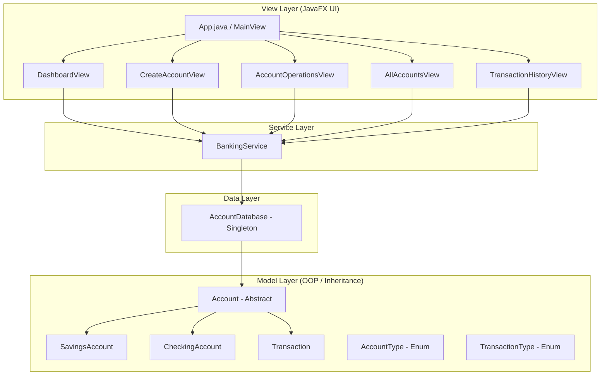

# 🏦 Transaction Management GUI

A sample banking transaction management system built with **Java** and **JavaFX**, demonstrating core object-oriented programming principles through a polished, modern GUI.


## ✨ Features

| Feature | Description |
|---------|-------------|
| **📊 Dashboard** | Real-time overview with summary cards and recent transactions |
| **➕ Create Account** | Open Savings or Checking accounts with custom parameters |
| **💳 Operations** | Deposit, withdraw, and apply interest with live balance updates |
| **📋 All Accounts** | Searchable table of all accounts with delete functionality |
| **📜 Transaction History** | Complete audit trail with account filtering |

## 🏗️ OOP Principles Demonstrated

| Principle | Implementation |
|-----------|---------------|
| **Abstraction** | `Account` abstract class defines the banking contract |
| **Inheritance** | `SavingsAccount` and `CheckingAccount` extend `Account` |
| **Polymorphism** | `withdraw()` enforces different rules per account type |
| **Encapsulation** | Private fields with controlled getter/setter access |
| **Singleton** | `AccountDatabase` ensures a single shared data store |

## 🏛️ Architectural Plan

The project follows a layered architecture combining the Model-View-Controller pattern with a service layer and singleton data access. This keeps the GUI separated from business logic while preserving a clean OOP model.



### OOP design breakdown

| Principle | Implementation |
|-----------|---------------|
| **Abstraction** | `Account` defines the common banking contract |
| **Inheritance** | `SavingsAccount` and `CheckingAccount` extend `Account` |
| **Polymorphism** | `withdraw()` behaves differently per concrete account type |
| **Encapsulation** | Properties are private and updated via controlled logic |
| **Singleton** | `AccountDatabase` maintains one shared runtime data store |

## 📱 Feature Explanations

### 1) Dashboard
The dashboard is the main system overview. It presents key account metrics such as total accounts, total balance, transaction count, and recent activity in a single page. This gives the user a quick operational snapshot of the banking system.

### 2) Create Account
The create account screen enables users to open either a savings or checking account. The form captures necessary details such as account holder name, initial deposit, interest rate, and minimum balance requirements, then passes them through the application logic for validation.

### 3) Operations
The operations page handles the core financial actions: deposit, withdrawal, and interest application. These actions are processed using the service layer, which updates balances and records each transaction consistently.

### 4) Transaction History
The transaction history view provides a full audit trail of the system. It logs every deposit, withdrawal, and interest event with timestamps, account references, amounts, and resulting balances for traceability and review.

## 📸 Screenshots

### Dashboard screen


The dashboard summarizes system health with summary cards, recent transaction records, and account overview panels.

### Create account screen

This form lets users create a new Savings or Checking account by entering basic details and initial financial values.

### Operations screen

This page allows direct deposit, withdrawal, and interest calculations for a selected account, keeping the banking workflow simple and visual.

### Transaction history screen

This table contains the complete ledger of all account transactions, making it easy to inspect account movement over time.

## 📁 Project Structure

```text
src/
├── main/java/com/banking/
│   ├── App.java                    # JavaFX Application entry point
│   ├── Launcher.java               # JAR-compatible launcher
│   ├── model/
│   │   ├── Account.java            # Abstract base class
│   │   ├── SavingsAccount.java     # Interest + minimum balance
│   │   ├── CheckingAccount.java    # Overdraft protection
│   │   ├── Transaction.java        # Immutable transaction record
│   │   ├── AccountType.java        # SAVINGS, CHECKING enum
│   │   └── TransactionType.java    # DEPOSIT, WITHDRAWAL, etc.
│   ├── database/
│   │   └── AccountDatabase.java    # Singleton in-memory store
│   ├── service/
│   │   └── BankingService.java     # Business logic layer
│   └── ui/
│       ├── MainView.java           # Sidebar + content layout
│       ├── DashboardView.java      # Summary cards & recent txns
│       ├── CreateAccountView.java  # Account creation form
│       ├── AccountOperationsView.java  # Deposit/Withdraw/Interest
│       ├── AllAccountsView.java    # Searchable accounts table
│       └── TransactionHistoryView.java # Filtered txn history
├── main/resources/com/banking/styles/
│   └── styles.css                  # Modern JavaFX styling
└── test/java/com/banking/
    ├── model/
    │   ├── SavingsAccountTest.java
    │   └── CheckingAccountTest.java
    ├── database/
    │   └── AccountDatabaseTest.java
    └── service/
        └── BankingServiceTest.java
```

## 🚀 Getting Started

### Prerequisites
- **Java 17+** (JDK)
- **Git**

### Clone & Run

```bash
# Clone the repository
git clone https://github.com/only-vikas/-Transaction-Management-GUI-.git
cd -Transaction-Management-GUI-

# Run the application (Maven Wrapper)
./mvnw javafx:run           # Linux/macOS
mvnw.cmd javafx:run         # Windows

# Run tests (59 unit tests)
./mvnw test                 # Linux/macOS
mvnw.cmd test               # Windows
```

### Build & Run Executable Fat JAR

```bash
# Package standalone uber-jar
mvnw.cmd package -DskipTests

# Run the shaded JAR directly
java -jar target/transaction-management-gui-1.0.0.jar
```

## 🧪 Testing

The project includes **30+ unit tests** covering:
- Account creation and validation
- Deposit and withdrawal operations
- Savings minimum balance enforcement
- Checking overdraft protection
- Interest application
- Database singleton behavior
- Service layer business logic

```bash
gradlew.bat test
```

## 📸 Screenshots

| Dashboard | Create Account | Operations |
|-----------|---------------|------------|
| Summary cards with real-time stats | Dynamic form for Savings/Checking | Deposit, Withdraw, Apply Interest |

## 🛠️ Tech Stack

- **Java 17+** — Core language
- **JavaFX 21** — GUI framework
- **Gradle** — Build automation
- **JUnit 5** — Testing framework

## 📄 License

This project is open source and available under the [MIT License](LICENSE).

---

*Built as a demonstration of Java OOP principles and JavaFX GUI development.*
